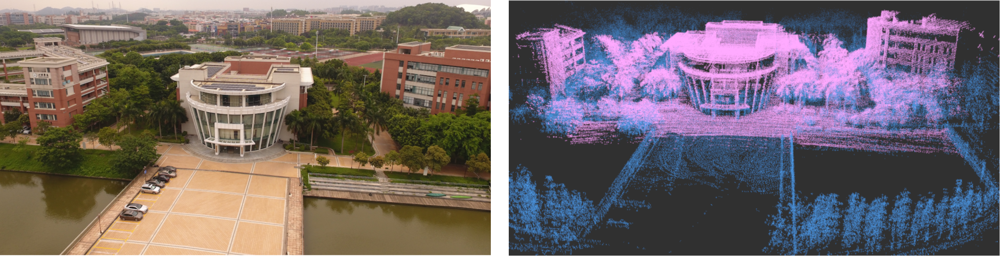
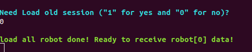
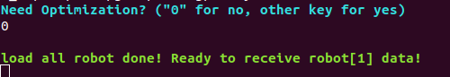
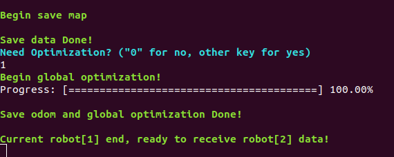
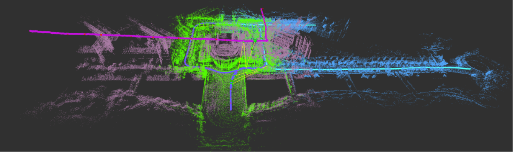
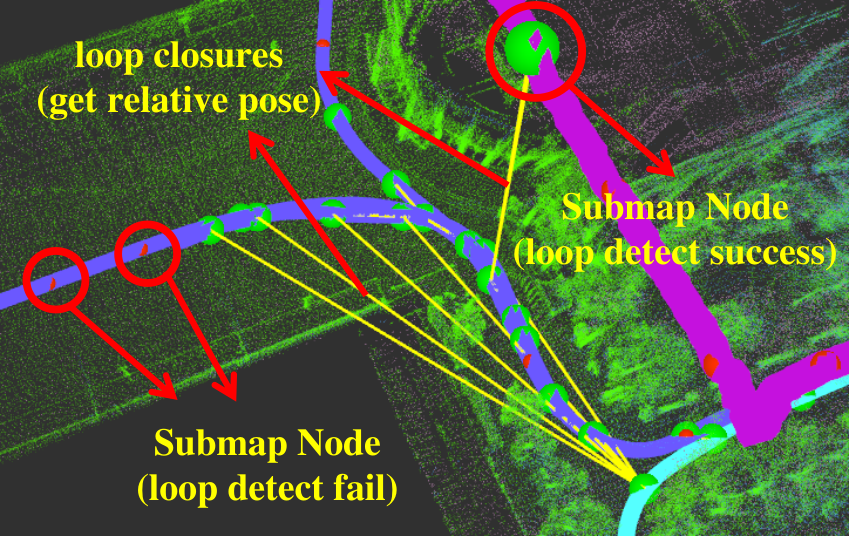
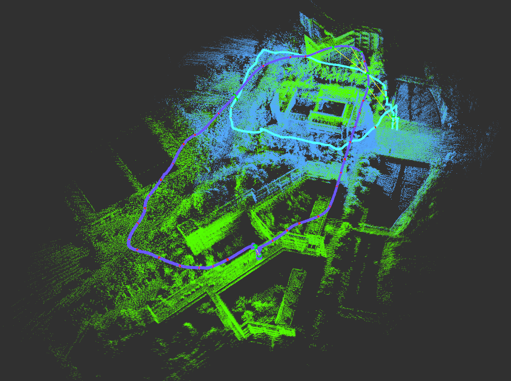
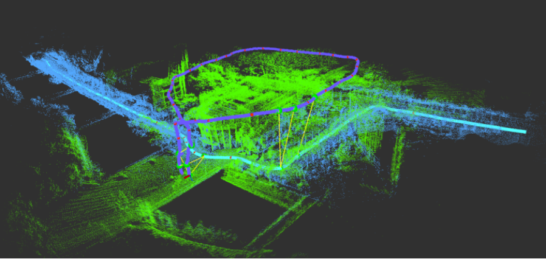
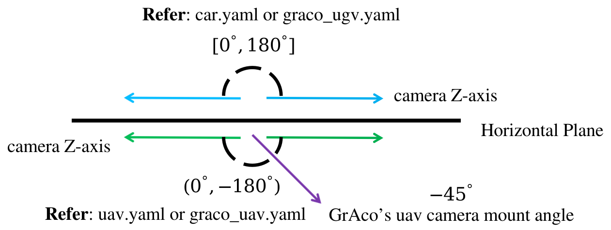

# GAC-Mapping

## Ground and Aerial Collaborative Mapping in Urban Environments

**Version 1.1.0**

new: Organize the code and documents; Use Patch-NetVLAD instead of NetVLAD for loop detect; Fix bugs and standardize algorithm input and output.


***GAC-Mapping (GACM for short)*** is a multi-session SLAM to solve the mapping and localization of ground-aerial heterogeneous robot clusters in urban scenes. In GACM, a **Visual-LiDAR** ego-motion estimation module that considers point, line and planar constraints can provide robust odometry information. Thumbnail images representing obstacle outlines are generated and descriptors are extracted using a neural network to help perform data association between separate runs. Map segments and the robot poses are organized together and are updated during a pose graph optimization procedure. We provide guidance and examples how to run GACM on sample data and [GrAco Dataset](https://sites.google.com/view/graco-dataset).

<div align="center">
    
</div>

**Viedo (Replay: X6)**

<div align="center">
	
</div>

**Contributors**

[Jinhao He 何晋豪](https://github.com/David-Willo)，Yuming Zhou 周榆明，Lixiang Huang 黄立祥，[Yang Kong 孔阳](https://github.com/JoenHune)，[Yilin Zhu 朱奕霖 (version 1.1.0 author)](https://github.com/inntoy) ，[Cheng Hui 成慧](https://cse.sysu.edu.cn/content/2504) from [SYSU RAPID Lab](http://lab.sysu-robotics.com/index.html)

**Related Papers**

* Jinhao He, Yuming Zhou, Lixiang Huang, Yang Kong, Hui Cheng\*, “**[Ground and Aerial Collaborative Mapping in Urban Environments](https://ieeexplore.ieee.org/document/9234707)**,”IEEE Robotics and Automation Letters, pp. 95-102, Oct, 2020

If our work has helped you, please cite:

```
@article{DBLP:journals/ral/HeZHKC21,
  author    = {Jinhao He and
               Yuming Zhou and
               Lixiang Huang and
               Yang Kong and
               Hui Cheng},
  title     = {Ground and Aerial Collaborative Mapping in Urban Environments},
  journal   = {{IEEE} Robotics Autom. Lett.},
  volume    = {6},
  number    = {1},
  pages     = {95--102},
  year      = {2021}
}
```

## Index

1. [Prerequisites](#Prerequisites)
2. [Build GACM on ROS](#build_GACM_on_ROS)
3. [Run GACM on datasets](#run_GACM_dataset)
   - [Operation process](#operation_process)
   - [Sample Data](#sample_data)
   - [GrAco Dataset](#GrAco_dataset)
4. [Run GACM on your own device](#run_GACM_own)
   - [Prepare device](#prepare_device)
   - [Prepare file](#prepare_file)
   - [Output file](#output_file)
   - [Known issues](#known_issues)
5. [Acknowledgements](#Acknowledgements)
6. [License](#License)


<a name="Prerequisites"></a>


## 1. Prerequisites 
1.1 **Ubuntu** and **ROS**

Ubuntu  18.04.
ROS Melodic. [ROS Installation](http://wiki.ros.org/cn/ROS/Installation)
additional ROS pacakge

```bash
sudo apt install ros-$ROS_DISTRO-cv-bridge ros-$ROS_DISTRO-tf ros-$ROS_DISTRO-message-filters ros-$ROS_DISTRO-image-transport
```

1.2 **Ceres Solver**

Test Version are 1.14.0 and 2.0.0. Follow [Ceres Installation](http://ceres-solver.org/installation.html), remember to **make install**. 
(Our testing environment: Ubuntu 18.04, ROS Melodic, OpenCV 3.2.0, Eigen 3.3.4, PCL 1.8.1) 

1.3 **Patch-NetVLAD**

Please refer to [Patch-NetVLAD](https://github.com/QVPR/Patch-NetVLAD) installation process. Our test is in anaconda.

If you need to replace the software source of anaconda, please follow the instructions in this [blog](https://blog.csdn.net/scl52tg/article/details/120959893).

```bash
# using gpu
conda create -n patchnetvlad python=3.8 numpy pytorch-gpu torchvision natsort tqdm opencv pillow scikit-learn faiss matplotlib-base -c conda-forge
# using cpu
conda create -n patchnetvlad python=3.8 numpy pytorch-cpu torchvision natsort tqdm opencv pillow scikit-learn faiss matplotlib-base -c conda-forge
```

Install rospy, rospkg and pyyaml by pip.

```bash
conda activate patchnetvlad
pip install pyyaml rospy rospkg
```


<a name="build_GACM_on_ROS"></a>

## 2. Build GACM on ROS
Clone the repository and catkin_make: (If [camera_model](https://github.com/hengli/camodocal) exists in your workspace, please remove it first)
```bash
    cd ~/catkin_ws/src
    git clone https://github.com/SYSU-RoboticsLab/GAC-Mapping.git
    cd ../
    catkin_make
```


<a name="run_GACM_dataset"></a>

## 3. Run GACM on dataset

We provide some sample data (including two ground sequences and one aerial sequence). In addition, we also provide configuration files for the [GrAco Dataset](https://sites.google.com/view/graco-dataset). You can also download the it for testing.

<a name="operation_process"></a>

### Operation process

- Open a terminal, run`roscore`.

- Open a new terminal, run Patch-NetVLAD to extract feature.

  ```bash
  conda activate patchnetvlad
  source ~/catkin_ws/devel/setup.bash
  cd ~/catkin_ws/src/GAC-Mapping/Patch-NetVLAD
  python feature_extract_ros.py
  # use only cpu
  python feature_extract_ros.py --nocuda
  ```

  GACM uses the pretrained model provided by [Patch-NetVLAD](https://github.com/QVPR/Patch-NetVLAD). The script will automatically download the corresponding model file, or you can download it manually. Please refer to the README file of [Patch-NetVLAD](https://github.com/QVPR/Patch-NetVLAD) for the download address.

  After testing, when using a 512-dimensional descriptor, the average thumbnail processing time is **0.007 seconds under GPU (NVIDIA TITAN X), and 0.085 seconds under CPU (i7-10710U)**.
  
- Open a new terminal.

  ```bash
  source ~/catkin_ws/devel/setup.bash
  roslaunch gacm gacm.launch
  ```

  After the algorithm runs, you can choose whether to load the data file from `gacm_output\data\testSavemap` or not (see [Output file](#output_file) for details).  If you choose not to load, then you can play rosbag directly.

  <div align="center">
      
  </div>


  If you choose to load, you need to wait for all data to be loaded. After loading, you can choose whether to perform pose graph optimization. **The optimization looks for new inter-robot loops based on the global coordinates of each submap.** If you think the mapping effect is good enough, or there are enough inter-robot loops, you don’t need to optimize it. Then you can play rosbag to run the algorithm.

  <div align="center">
      
  </div>


  After rosbag finishes, wait a moment (about 10 seconds), the algorithm will save data files and ask you whether to perform pose graph optimization.  However, if it's the end of the first sequence (robot id is 0), the pose graph optimization will not be performed by default. After optimization, the algorithm will save the odometry file. When all files are saved, you can run the next rosbag or exit directly.

  <div align="center">
      
  </div>


  Finally, we recommend playing ground rosbags first, then air ones.

<a name="sample_data"></a>

### Sample Data

1. download data:	[**car1.bag**](https://1drv.ms/u/s!AmSRwVTuK0YFgSHcSizUSuxBXWwJ?e=G1CeIz)	[**car2.bag**](https://1drv.ms/u/s!AmSRwVTuK0YFgSLH6vAPe17bv3uQ?e=fUvOga)	[**uav.bag**](https://1drv.ms/u/s!AmSRwVTuK0YFgSNdroJ4YPZCHVny?e=dbdNc5)

2. Run the `feature_extract_ros.py` script and `gacm.launch` file according to the [operation process section](#operation_process).

3.  Play **car1.bag**, **car2.bag** and **uav.bag** file in sequence and and follow the [operation process section](#operation_process).

4. After all rosbags are played, you can see the map shown in the picture below on rviz. The trajectories and point cloud maps of different robots have different colors. 

   <div align="center">
       
   </div>

5. Also, you can see that there are yellow lines connecting some parts of the trajectory, which means that loop closures are not only detected but relative poses are obtained.

   <div align="center">
       
   </div>

<a name="GrAco_dataset"></a>

### GrAco Dataset

**Dataset website**: https://sites.google.com/view/graco-dataset

**Notice**: If you plan to run `ground-05` (duration over 400 seconds), you need to set the `submap_length` parameter in the configuration file to 70 or more.

- #### **Aerial-Aerial**

  **play order**:  Aerial-07 -> Aerial-05

  Change `graco.launch` configration file order

  ```html
  <arg name="config_path" default = "$(find gacm)/config/graco_uav.yaml" />
  <arg name="config_path1" default = "$(find gacm)/config/graco_uav.yaml" />
  ```

  run `feature_extract_ros.py` and `graco.launch`.

  <div align="center">
      
  </div>


- #### Ground-Aerial

  **play order**:  Ground-06 -> Aerial-07

  Change `graco.launch` configration file order

  ```html
  <arg name="config_path" default = "$(find gacm)/config/graco_ugv.yaml" />
  <arg name="config_path1" default = "$(find gacm)/config/graco_uav.yaml" />
  ```

  run `feature_extract_ros.py` and `graco.launch`.

  <div align="center">
      
  </div>


<a name="run_GACM_own"></a>

## 4. Run GACM on your own device

<a name="prepare_device"></a>

### Prepare device

GACM uses Visual-LiDAR odometry as a front end, which means your device should contain LiDAR and camera. In addition, the front-end LiDAR part of GACM will generate a depth image based on the LiDAR point cloud to assist the visual part to restore the depth of the feature. So GACM also has certain requirements for the synchronization and placement of sensors.

- **Do your best to keep in sync:** Both the LiDAR and the camera in our device use hardware triggers to ensure time stamp synchronization. If your device synchronization is not good, you can reduce the weight of the visual part by reducing the value of `visual_weight_max` (in the configuration file).
- **Face the same direction:** Because the point cloud is used to help image features recover depth, the overlapping of the field of view between the camera and LiDAR should be as much as possible. Our LiDAR uses Velodyne VLP16 (it has a vertical field of view of only 30 degrees). So if you have a mechanical LiDAR with a larger field of view, the effect of depth recovery is definitely better. **However, the current algorithm does not support solid LiDAR (Livox).**
- **Rotation is important:** For the extrinsic parameter of LiDAR and camera, we found that the error on the rotation has a greater impact on the accuracy of the odometry than the translation. For calibration, you can try adding an imu. Then complete the calibration of LiDAR-Imu and Camera-Imu respectively, get their respective extrinsic parameters. Finally, the extrinsic parameter of LiDAR-Camera are indirectly obtained by calculation LiDAR-Imu and Camera-Imu.

<a name="prepare_file"></a>

### Prepare file

1. **Create your own device configuration file**

   You can modify the configuration file we provide to adapt to your device. The configuration file is under the`GAC-Mapping/gacm/config/`folder. 

   If your camera z-axis is above the horizontal plane, you can refer to the `car.yaml` or `graco_ugv.yaml` file.

   If your camera z-axis is below the horizontal plane (such as the way the camera is mounted on the drone in the GrAco dataset), you can refer to the `uav.yaml` or `graco_uav.yaml`.

   <div align="center">
       
   </div>

2. **Create your own roslaunch file**

   GACM is **multi-session** SLAM, which supports running up to 5 different sequences. As shown below, you should modify the config file path for each sequence. When playing rosbag, be sure to play in the order of the configuration file.

   ```html
   <arg name="config_path" default = "$(find gacm)/config/car.yaml" />
   <arg name="config_path1" default = "$(find gacm)/config/car.yaml" />
   <arg name="config_path2" default = "$(find gacm)/config/uav.yaml" />
   <arg name="config_path3" default = "$(find gacm)/config/uav.yaml" />
   <arg name="config_path4" default = "$(find gacm)/config/uav.yaml" />
   ```

   Also, you can change the pointcloud and image topic name by remap.

   ```html
   <node pkg="gacm" type="featureTrackingNode" name="featureTrackingNode"    		output="screen">
   	...
       <!-- change your topic name -->
       <remap from="/image_raw" to="/camera_left/image_raw" />		
       <remap from="/velodyne_points" to="/velodyne/points" />
   </node>
   ```

<a name="output_file"></a>

### Output file

#### Data file

GACM will save all the data stored in the current algorithm at the end of each sequence of data (rosbag play ends). This allows GACM to start from the end of the previous sequence without re-running all sequences. These data files will be stored in the `gacm_output/data/testSavemap` folder in the **user's home directory** (such as `/home/sysu-rapid`). 

The data files includes loop closure information for each sequence, pose graph node and edge information, pcd files of corner points, planar points and thumbnail point clouds of submap, and point cloud maps before and after fusion.

#### Odometry file

When a sequence ends, GACM automatically saves the odometry file for each sequence in tum format (timestamp[s] x y z q_x q_y q_z q_w). But you should modify the save path of the file in the configuration file! Otherwise the file will be saved in the `gacm_output/data/testSavemap` folder.

#### Thumbnail file

You can view the thumbnails generated by the algorithm in real time under the `gacm_ouput/pictures/submap_img` folder.

<a name="known_issues"></a>

### Known issues

1. In order to reduce the memory usage when the code is running, each sequence can only generate up to 100 submap. The number of lidar frames contained in each submap can be set (`submap_length` parameter). Assume that the period of each frame of lidar point cloud is 0.1 second, parameter `submap_length` is 50. Each sequence can only run for a maximum of 500 seconds (0.1 x 50 x 100 = 500). However, after testing, the running time of a sequence should not exceed 400 seconds, otherwise it may affect the real-time performance of the algorithm.
2. The inter-robot loop detection of the algorithm is unstable. After testing, for the same submap, the descriptors generated by Patch-NetVLAD may be different, which will affect loop closure detection. In addition, the point cloud registration results of NDT+GICP will also be greatly affected by **the size of submap point cloud** ( `submap_length`, `surf_threshold`), **matching parameters** (`ndt_resolution_match`), and **the initial values**. Therefore, even if the correct loop closure is detected, the correct relative pose may not be obtained.


<a name="Acknowledgements"></a>

## 5. Acknowledgements
We use [ceres solver](http://ceres-solver.org/) for non-linear optimization and a generic [camera model](https://github.com/hengli/camodocal),  [Patch-NetVLAD](https://github.com/QVPR/Patch-NetVLAD) for loop dectect and [skipmap_ros](https://github.com/m4nh/skimap_ros) to manage submap. In addition, this algorithm refers to the [A-LOAM](https://github.com/HKUST-Aerial-Robotics/A-LOAM), [LeGO-LOAM](https://github.com/RobustFieldAutonomyLab/LeGO-LOAM) and [VINS-mono](https://github.com/HKUST-Aerial-Robotics/VINS-Mono). We really appreciate these open source projects!


<a name="License"></a>

## 6. License

The source code is released under [GPLv3](http://www.gnu.org/licenses/) license.
